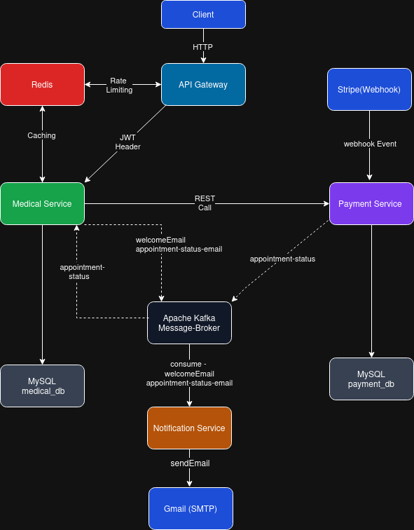
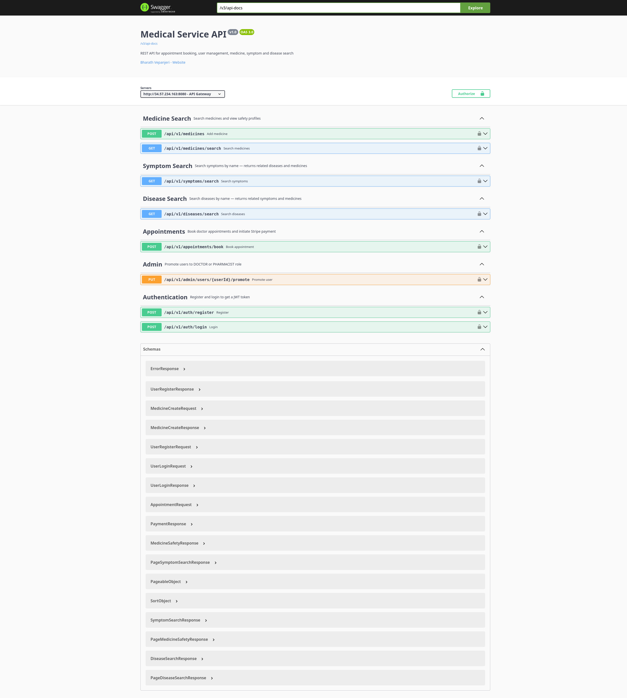
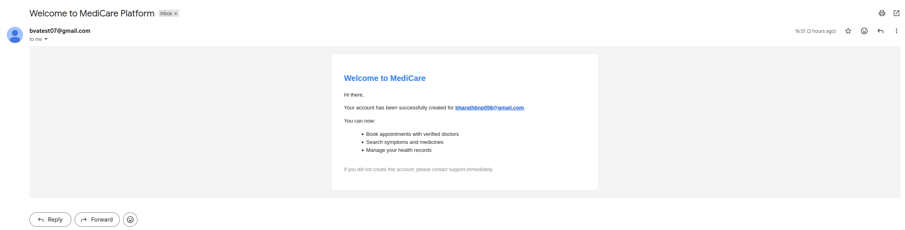
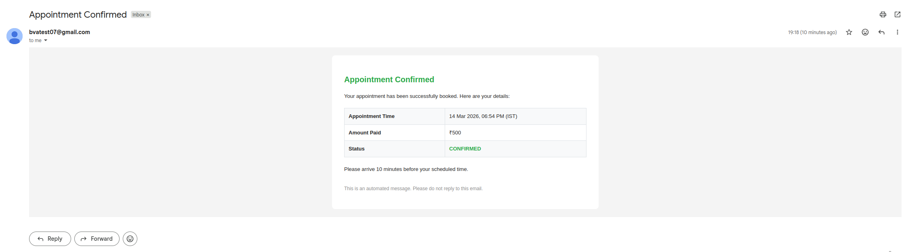
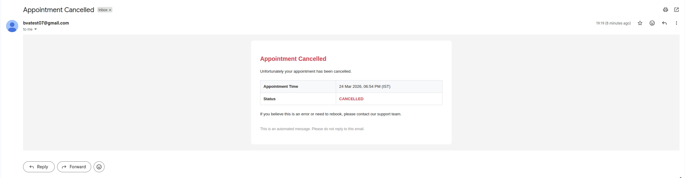

# Distributed Medical Platform

A backend system built with Java and Spring Boot, designed as a set of loosely coupled microservices. The platform handles user authentication, medical data search, appointment booking, payment processing, and email notifications.

---

## Live Demo

| Service                 | URL                                             |
| ----------------------- | ----------------------------------------------- |
| API Gateway             | http://34.57.234.163:8080                       |
| Medical Service Swagger | http://34.57.234.163:7070/swagger-ui/index.html |

> Deployed on GCP using Docker Compose. All client requests go through the API Gateway on port 8080.

---

## Architecture

<p align="center">
  
</p>

---

## Screenshots

### Medical Service — Swagger UI

<p align="center">
  
</p>

### Email Notifications (via Kafka → Notification Service → Gmail SMTP)

<p align="center">
  
</p>
<p align="center">
  
</p>
<p align="center">
  
</p>

---

## Services

### API Gateway (Port 8080)

- Centralized JWT validation — downstream services receive pre-verified user identity via headers (`X-User-Id`, `X-User-Role`)
- Redis-based token bucket rate limiting — 20 req/s (core), 10 req/s (payments)
- Global request/response logging with latency tracking
- Public route bypass for auth and Stripe webhook endpoints

### Medical Service (Port 7070)

- Role-based access control (PATIENT, DOCTOR, PHARMACIST) enforced via Spring Security
- Paginated search for medicines, diseases, and symptoms with Redis caching
- Appointment booking with optimistic locking to prevent double-booking
- Flyway database migrations for reproducible schema management
- Publishes Kafka events on user registration and appointment status changes
- Communicates with Payment Service via REST

### Payment Service (Port 8082 — Internal)

- Stripe Checkout session creation with idempotency key (prevents duplicate charges on retry)
- Webhook handler for `checkout.session.completed` and `payment_intent.payment_failed` events
- Gateway pattern (`PaymentGateway` interface + `StripePGAdapter`) — easily swap payment providers
- Publishes payment status back to Medical Service via Kafka

### Notification Service (Port 8083 — Internal)

- Kafka consumers for welcome emails and appointment confirmation/cancellation
- HTML email templates for professional notifications
- Mail failures are caught and logged — consumer does not crash on email errors

---

## Tech Stack

| Technology              | Usage                              |
| ----------------------- | ---------------------------------- |
| Java 17                 | Primary language                   |
| Spring Boot 3           | Application framework              |
| Spring Cloud Gateway    | API Gateway with reactive WebFlux  |
| Spring Security         | Role-based auth, JWT filter chain  |
| Spring Data JPA         | ORM for MySQL                      |
| Flyway                  | Database schema migration          |
| MySQL 8                 | Primary relational database        |
| Redis 7                 | Rate limiting + response caching   |
| Apache Kafka (KRaft)    | Async inter-service communication  |
| Stripe Java SDK         | Payment processing                 |
| JWT (jjwt 0.12.x)       | Stateless authentication           |
| Springdoc OpenAPI       | Swagger UI documentation           |
| Docker + Docker Compose | Containerization and orchestration |
| JUnit 5 + Mockito       | Unit testing                       |
| Lombok                  | Boilerplate reduction              |

---

## Key Design Decisions

**JWT validated at gateway, not per service**
The API Gateway validates JWT and forwards user identity as headers. Downstream services trust these headers and skip re-validation, reducing latency and centralizing auth logic.

**Redis rate limiting with token bucket**
Each IP gets a token bucket (20 tokens/s for core, 10 for payments). Stricter limits on payment routes reduce exposure to abuse.

**Idempotent payment creation**
The appointment ID is used as the Stripe idempotency key. Retried requests return the existing session instead of creating duplicate charges.

**Optimistic locking on appointments**
The `Appointment` entity uses `@Version` to prevent race conditions when two patients try to book the same doctor slot simultaneously.

**Kafka for async notification delivery**
Email sending is decoupled from the main request flow. A failed email does not roll back a successful booking or payment.

**Gateway pattern for payment provider**
`PaymentGateway` interface abstracts the Stripe implementation. Switching to Razorpay requires only a new adapter — no changes to business logic.

**N+1 prevention with @EntityGraph**
`SymptomRepository` and `MedicineRepository` use `@EntityGraph` to eagerly load associations in a single query, avoiding N+1 SELECT problems.

**Cache eviction on writes**
`@CacheEvict` on medicine creation invalidates `disease-search` and `symptom-search` caches to keep Redis consistent with the database.

---

## Running Locally with Docker

**Prerequisites**

- Docker + Docker Compose
- Stripe account (test mode)
- Gmail account with App Password enabled

**Setup**

```bash
git clone https://github.com/bharath-vepanjeri/distributed-medical-platform
cd distributed-medical-platform
cp .env.example .env      # fill in your values
docker compose up -d      # pulls all images from Docker Hub and starts
```

All 8 containers start automatically in the correct order with health checks.

**Services available at:**

| Service                 | URL                                         |
| ----------------------- | ------------------------------------------- |
| API Gateway             | http://localhost:8080                       |
| Medical Service Swagger | http://localhost:7070/swagger-ui/index.html |

---

## Environment Variables

Copy `.env.example` to `.env` and fill in your values:

| Variable                | Used by                          | Description                         |
| ----------------------- | -------------------------------- | ----------------------------------- |
| `DB_USERNAME`           | medical-service, payment-service | MySQL username                      |
| `DB_PASSWORD`           | medical-service, payment-service | MySQL password                      |
| `JWT_KEY`               | api-gateway, medical-service     | JWT signing secret (min 32 chars)   |
| `STRIPE_KEY`            | payment-service                  | Stripe secret key (`sk_test_...`)   |
| `STRIPE_WEBHOOK_SECRET` | payment-service                  | Stripe webhook secret (`whsec_...`) |
| `MAIL_USERNAME`         | notification-service             | Gmail address                       |
| `MAIL_PASSWORD`         | notification-service             | Gmail App Password                  |

---

## Docker Hub Images

| Image                                          | Link                                                                         |
| ---------------------------------------------- | ---------------------------------------------------------------------------- |
| `bharathvepanjeri/medical-service:latest`      | [Docker Hub](https://hub.docker.com/r/bharathvepanjeri/medical-service)      |
| `bharathvepanjeri/payment-service:latest`      | [Docker Hub](https://hub.docker.com/r/bharathvepanjeri/payment-service)      |
| `bharathvepanjeri/api-gateway:latest`          | [Docker Hub](https://hub.docker.com/r/bharathvepanjeri/api-gateway)          |
| `bharathvepanjeri/notification-service:latest` | [Docker Hub](https://hub.docker.com/r/bharathvepanjeri/notification-service) |

---

## API Overview

| Method | Endpoint                           | Auth    | Description                         |
| ------ | ---------------------------------- | ------- | ----------------------------------- |
| POST   | `/api/v1/auth/register`            | Public  | Register new user                   |
| POST   | `/api/v1/auth/login`               | Public  | Login, returns JWT                  |
| GET    | `/api/v1/medicines/search?name=`   | JWT     | Search medicines + safety profiles  |
| GET    | `/api/v1/diseases/search?query=`   | JWT     | Search diseases                     |
| GET    | `/api/v1/symptoms/search?name=`    | JWT     | Search symptoms                     |
| POST   | `/api/v1/appointments/book`        | PATIENT | Book appointment + initiate payment |
| PUT    | `/api/v1/admin/users/{id}/promote` | ADMIN   | Promote user to DOCTOR/PHARMACIST   |

---

## Project Structure

```
distributed-medical-platform/
├── api-gateway/              # Spring Cloud Gateway — JWT auth, rate limiting
├── medical-service/          # Core domain — users, appointments, search
├── payment-service/          # Stripe payments + webhook handling
├── notification-service/     # Kafka consumer — email notifications
├── docker/
│   └── mysql/
│       └── 00_init.sh        # Creates medical_db and payment_db
├── docs/
│   ├── architecture.png
│   └── screenshots/
├── docker-compose.yml
└── .env.example
```
